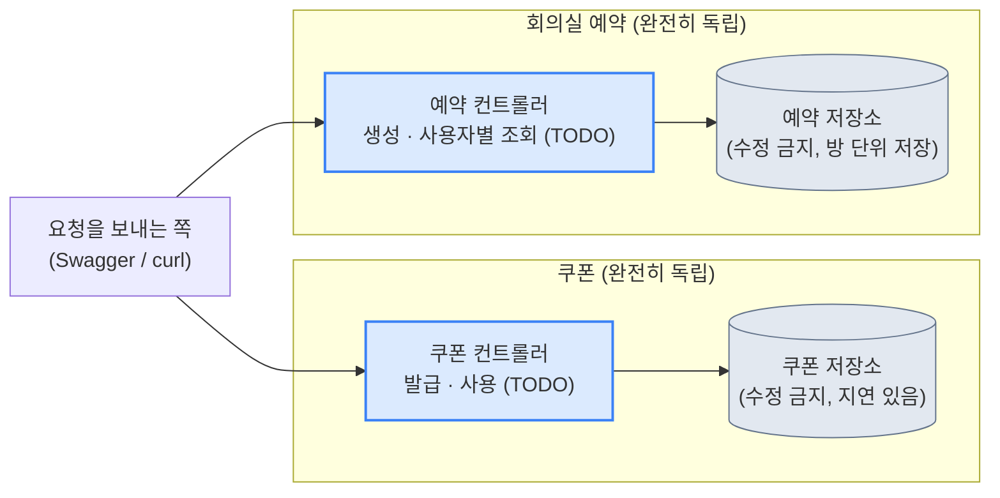

# 쿠폰 사용과 회의실 예약 (동시성 워밍업)

> 백엔드 실습 과제 · 상태: **문서 확정 v1.0** (2026-09-30) · 뼈대 프로젝트·정답 서버로 모든 시나리오 실제 검증 완료

> [!IMPORTANT]
> 이 과제는 **워밍업**입니다. 과제 1~3보다 훨씬 짧고 단순합니다. 그래도 정해진 약속(경로, 요청·응답 형식)은 그대로 지키고, 그 안의 구현 방법은 스스로 결정합니다.

> [!TIP]
> 📄 **처음이라 막막하다면 [`docs/requirements-overview.pdf`](docs/requirements-overview.pdf)부터 열어보세요.** 그림 위주로 큰 그림을 3페이지로 정리한 요약본입니다.

## 한눈에 보기

| | |
|---|---|
| 🎯 **보는 능력** | 동시성 제어의 폭 — 무엇을 "하나만" 지켜야 하는지, 얼마나 넓게 잠가야 하는지 |
| 🧩 **만드는 것** | 서로 독립된 두 영역: 쿠폰 사용, 회의실 예약 (Java 17 · Spring Boot 4.1.1 · Gradle, DB 없음) |
| 📦 **제공되는 것** | `TODO` 4개가 있는 뼈대 프로젝트 (수정 금지 저장소 2개 포함) |
| ⏱️ **제한 시간** | 없음 (강의 분량 1~1.5시간짜리 워밍업) |
| ⚠️ **핵심 난제** | "확인하고 나서 저장한다"는 같은 함정이 두 영역에 각각 다른 모양으로 숨어 있음 |

## 목차

- [이 폴더에는 무엇이 있나](#이-폴더에는-무엇이-있나)
- [1. 과제 소개](#1-과제-소개)
- [2. 여러분이 하는 것과 제공되는 것](#2-여러분이-하는-것과-제공되는-것)
- [3. 시작하기](#3-시작하기)
- [4. 알아야 할 용어](#4-알아야-할-용어)
- [5. 약속 1 — 쿠폰 API](#5-약속-1--쿠폰-api)
- [6. 약속 2 — 회의실 예약 API](#6-약속-2--회의실-예약-api)
- [7. 시나리오 체크리스트](#7-시나리오-체크리스트)
- [8. 제출](#8-제출)
- [9. 평가 안내](#9-평가-안내)
- [10. 막혔을 때 (힌트)](#10-막혔을-때-힌트)

---

## 이 폴더에는 무엇이 있나

| 파일·폴더 | 용도 |
|---|---|
| `README.md` (이 문서) | 과제 설명, 약속, 시나리오, 힌트 — 전부 여기 있습니다 |
| [`docs/requirements-overview.pdf`](docs/requirements-overview.pdf) | **처음 보시는 분들을 위한 요약본** (3페이지, 그림 위주) |
| `starter-project/` | **여기서 시작하세요.** `TODO` 4개가 있는 컨트롤러, 수정 금지 저장소 2개가 들어 있습니다 |
| `requests.http` | IntelliJ HTTP Client용 요청 예시 (동시 요청 시나리오는 셸 스크립트 예시 포함) |

## 1. 과제 소개

서로 관계없는 **두 가지 작은 문제**를 풉니다.

1. **쿠폰**: 사용자가 쿠폰을 여러 장 가질 수 있고, 결제할 때 가장 유리한 쿠폰 1장이 자동으로 적용됩니다. 같은 쿠폰이 **두 번 쓰이면 안** 됩니다.
2. **회의실 예약**: 같은 방을 **겹치는 시간**에 두 번 예약할 수 없습니다.

두 문제 모두 **"확인하고 나서 저장한다"**는 같은 함정이 있습니다. 동시에 여러 요청이 오면 확인한 내용이 순식간에 낡은 정보가 될 수 있습니다.

> [!TIP]
> **이 과제에서 보는 능력: 동시성 제어의 폭.**
> - 무엇을 "하나만" 지켜야 하는지 파악하기 (쿠폰: 자원 하나, 예약: 시간 구간)
> - **얼마나 넓게** 잠가야 하는지 판단하기 (다른 사용자·다른 방까지 막으면 안 됨)

## 2. 여러분이 하는 것과 제공되는 것

| | 내용 |
|---|---|
| **제공되는 것** | 뼈대 프로젝트 (`TODO`가 있는 컨트롤러 2개, 수정 금지 저장소 2개), 이 가이드 |
| **여러분이 하는 것** | `TODO` 4개 구현 (쿠폰 발급·사용, 예약 생성·사용자별 조회) |
| 스택 | Java 17, Spring Boot 4.1.1, Gradle (DB 없음, 순수 인메모리) |
| 제한 | 서버는 1대, 외부 서비스 없음 |
| 제한 시간 | 없음 |

> [!IMPORTANT]
> **수정하면 안 되는 것**: 쿠폰 저장소·쿠폰 클래스, 예약 저장소·예약 클래스의 시그니처, 경로와 요청·응답 형식. 나머지는 자유롭게 클래스를 추가해도 됩니다.

**쿠폰과 회의실 예약은 완전히 독립된 문제입니다.** 한쪽을 못 풀어도 다른 쪽과 무관합니다. 다음은 두 영역의 구조입니다.



## 3. 시작하기

1. `starter-project/`를 IntelliJ에서 엽니다.
2. 서버를 실행합니다.
   ```bash
   ./gradlew bootRun
   ```
   서버는 `8080` 포트에서 실행됩니다. Docker나 다른 서버는 필요 없습니다.

## 4. 알아야 할 용어

| 용어 | 뜻 |
|---|---|
| **확인 후 실행 (check-then-act)** | "있는지 확인하고, 있으면 처리"처럼 확인과 처리 사이에 다른 요청이 끼어들 수 있는 패턴 |
| **락 (잠금)** | 한 번에 하나의 요청만 특정 구간을 실행하게 하는 장치 |
| **락의 폭(범위)** | 무엇을 기준으로 잠그는가. 너무 넓으면(예: 전체 잠금) 상관없는 요청까지 기다려야 함 |
| **시간 구간이 겹친다** | 두 구간의 시작·끝이 서로 걸쳐 있는 것. 맞닿기만 한 경우(10~11시, 11~12시)는 겹치는 것이 아님 |

---

## 5. 약속 1 — 쿠폰 API

### 5-1. 쿠폰 발급

`POST /api/users/{userId}/coupons`

```json
{ "type": "PERCENT_15" }
```

쿠폰 종류(**이 4개뿐, 추가·변경 금지**): `PERCENT_15`(15% 할인), `PERCENT_5`(5% 할인), `WON_3000`(3,000원 할인), `WON_800`(800원 할인)

| 상황 | 상태 코드 |
|---|---|
| 발급 성공 | **204** (본문 없음) |
| 잘못된 `type` | **400** `{"code":"INVALID_REQUEST","message":"..."}` |

### 5-2. 보유 쿠폰 조회 (제공됨, 수정 금지)

`GET /api/users/{userId}/coupons` → `[{"id":1,"type":"PERCENT_15"},{"id":2,"type":"WON_800"}]` (없으면 빈 배열)

### 5-3. 쿠폰 사용

`POST /api/users/{userId}/coupons/use`

```json
{ "amount": 10000 }
```

**규칙**
- 서버가 사용자의 보유 쿠폰 중 **이 금액에 적용했을 때 할인액이 가장 큰 쿠폰 1장**을 자동으로 골라 적용합니다.
- 정률 쿠폰의 할인액은 `금액 × 비율`을 **원 단위 미만 절사**합니다.
- 정액 쿠폰의 할인액은 **`min(정액, 금액)`** 입니다 (최종 금액이 음수가 되지 않도록).
- 적용된 쿠폰은 **사라집니다** (다시 쓸 수 없음).

**응답**

```json
{ "originalAmount": 10000, "discountAmount": 1500, "finalAmount": 8500, "couponType": "PERCENT_15" }
```

| 상황 | 상태 코드 | 본문 |
|---|---|---|
| 성공 | **200** | 위 형식 |
| 쓸 수 있는 쿠폰이 없음 | **404** | `{"code":"NO_COUPON_AVAILABLE","message":"..."}` |
| `amount`가 0 이하 | **400** | `{"code":"INVALID_REQUEST","message":"..."}` |

---

## 6. 약속 2 — 회의실 예약 API

### 6-1. 예약 생성

`POST /api/reservations`

```json
{ "roomId": "R1", "userId": "U1", "from": "10:00", "to": "11:00" }
```

- 시각은 **`HH:mm`** 형식입니다 (24시간, 날짜 없이 하루 단위).
- `from`은 `to`보다 빨라야 합니다.

**같은 방**에서 **겹치는 시간**의 예약은 거절됩니다. 두 구간 `[a.from, a.to)`와 `[b.from, b.to)`가 겹친다는 것은 `a.from < b.to && b.from < a.to`를 뜻합니다. **맞닿기만 한 경우는 겹치는 것이 아닙니다** (10:00~11:00과 11:00~12:00은 둘 다 예약 가능).

| 상황 | 상태 코드 | 본문 |
|---|---|---|
| 성공 | **201** | `{"roomId":"R1","userId":"U1","from":"10:00","to":"11:00"}` |
| 시간이 겹침 | **409** | `{"code":"TIME_CONFLICT","message":"..."}` |
| 입력 오류 (형식, `from >= to`, 필수값 누락) | **400** | `{"code":"INVALID_REQUEST","message":"..."}` |

### 6-2. 방별 예약 조회 (제공됨, 수정 금지)

`GET /api/reservations/rooms/{roomId}` → `[{"userId":"U1","from":"10:00","to":"11:00"}]`

### 6-3. 사용자별 예약 조회

`GET /api/reservations/users/{userId}` → `[{"roomId":"R1","from":"10:00","to":"11:00"}]` (그 사용자의 예약만, 방을 가리지 않고 모아서)

---

## 7. 시나리오 체크리스트

아래 시나리오가 모두 기대대로 동작해야 합니다.

| # | 시나리오 | 기대 결과 |
|---|---|---|
| S1 | 정상 발급 후 사용 | 보유 쿠폰 중 **할인액이 가장 큰 쿠폰**이 적용되고 사라짐 |
| S2 | 쿠폰 2장 보유, **동시에** 사용 요청 2건 | **2건 모두 성공**, 서로 다른 쿠폰이 하나씩 소모됨 |
| S3 | 쿠폰 1장 보유, **동시에** 사용 요청 5건 | **정확히 1건만 성공**, 나머지 4건은 404 |
| S4 | 쿠폰이 없을 때 사용 요청 | 404 |
| S5 | 서로 다른 사용자의 사용 요청이 동시에 옴 | 서로 영향 없이 병렬 처리됨 |
| S6 | 정상 예약 | 201 |
| S7 | 같은 방, 겹치는 시간으로 (순차) 다시 예약 | 409 |
| S8 | 같은 방, **겹치는 시간**으로 **동시에** 5건 예약 | **정확히 1건만 201**, 나머지 409 |
| S9 | 같은 방, **겹치지 않는** 시간(예: 10~11시, 11~12시) | **둘 다 201** |
| S10 | **다른 방**에 같은 시간으로 동시에 예약 | **둘 다 201** |
| S11 | 사용자별 예약 조회 | 그 사용자의 예약만 나옴 |

> 예) S3: 쿠폰이 1장뿐인 사용자에게 사용 요청 5건이 동시에 오면, **1건만 200이고 나머지 4건은 404**여야 합니다. 사용액을 두 번 할인해 주면 안 됩니다.

## 8. 제출

| 항목 | 규칙 |
|---|---|
| 구조 | 뼈대 프로젝트에서 이어서 작업 |
| 실행 | 루트에서 `./gradlew bootRun`, 포트 **8080** |
| README | 실행 방법과, **락을 어디에 어떻게 걸었는지 3~4줄로 설명** (긴 문서 아님) |
| 수정 금지 | 저장소, 계약을 바꾸지 않습니다 |

## 9. 평가 안내

| 영역 | 배점 | 내용 |
|---|---|---|
| A. 정확성 | 70 | 쿠폰(S1~S5) 35, 회의실 예약(S6~S10) 35 |
| B. 코드 품질 | 30 | 락의 범위가 적절한가, 구조가 읽기 쉬운가, README 설명 |

> [!WARNING]
> **이렇게 하면 크게 감점됩니다**
> - 같은 쿠폰이 두 번 사용됨
> - 같은 방에 겹치는 예약이 동시에 두 건 이상 성공함
> - 서버가 실행되지 않음

## 10. 막혔을 때 (힌트)

막혔을 때 **하나씩만** 열어 보세요.

<details>
<summary><b>힌트 1: 무엇을 기준으로 잠글까</b></summary>
<br>

쿠폰은 **사용자**마다, 예약은 **방**마다 다른 락을 쓰면 어떨까요? 왜 "전체 하나의 락"보다 나을까요?

</details>

<details>
<summary><b>힌트 2: 쿠폰 목록의 함정</b></summary>
<br>

제공된 조회 API는 저장소 내부의 리스트를 그대로 돌려줍니다. 이걸 그대로 들고 있다가 나중에 쓰면 무슨 일이 생길 수 있을까요?

</details>

<details>
<summary><b>힌트 3: 예약 겹침</b></summary>
<br>

겹침을 확인하는 코드와 저장하는 코드가 떨어져 있으면, 그 사이에 다른 요청이 끼어들 수 있습니다. 어떻게 하나로 묶을까요?

</details>
